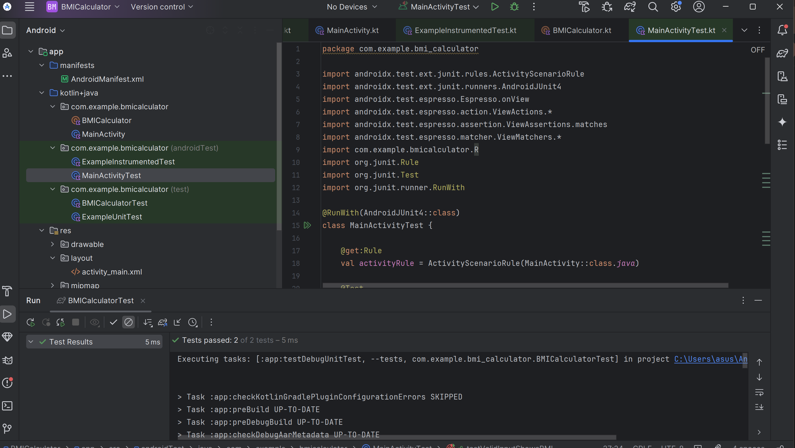

# 🧮 Aplikasi Kalkulator BMI - Android

**Kalkulator BMI (Body Mass Index)** sederhana berbasis Android yang dibuat menggunakan Kotlin. Aplikasi ini memungkinkan pengguna menghitung nilai BMI berdasarkan berat badan dan tinggi badan, serta menampilkan kategori kesehatan sesuai standar WHO.

---
## 👨‍💻 Pengembang
Dibuat dengan ❤️ menggunakan Kotlin dan Jetpack Android oleh [Iwani Khairina - 22208107010078].

## ✨ Fitur Unggulan

- 📲 Antarmuka yang bersih dan mudah digunakan
- ⚖️ Perhitungan BMI secara real-time berdasarkan satuan metrik (kg dan cm)
- 🩺 Klasifikasi otomatis kategori BMI (Kurus, Normal, Gemuk, Obesitas)
- 🧪 Pengujian lokal (unit test) dan instrumentasi (UI test) menggunakan JUnit & Espresso
- ☑️ Validasi input dan umpan balik kepada pengguna

---

## 📱 Tangkapan Layar


---

## 🚀 Cara Menjalankan Aplikasi

### Persyaratan
- Android Studio (versi Arctic Fox ke atas direkomendasikan)
- Android SDK minimal API 21
- Kotlin

### Langkah-langkah
1. Clone repository ini:
   ```bash
   git clone https://github.com/iwanikhairina/Iwanikhairina_2208107010078.git

2. Buka folder project di Android Studio
3. Sinkronisasi Gradle
4. Jalankan aplikasi di emulator

### Cara Menjalankan Proyek di Android Studio
Proyek ini dibuat dan dikembangkan sepenuhnya menggunakan **Android Studio**. Berikut langkah-langkah untuk menjalankannya:
1. **Buka folder proyek di Android Studio**  
   Pilih opsi `Open` saat Android Studio terbuka, lalu arahkan ke folder tempat kamu menyimpan repository ini.
2. **Sinkronisasi Gradle**  
   Setelah proyek terbuka, Android Studio biasanya akan otomatis menanyakan untuk **Sync Gradle**. Klik `Sync Now`, atau klik menu `File > Sync Project with Gradle Files`.
3. **Jalankan aplikasi di emulator atau perangkat nyata**  
   Klik tombol ▶️ (Run) di toolbar Android Studio. Pilih emulator Android yang tersedia atau hubungkan perangkat Android secara langsung untuk menjalankan aplikasi.

## 🧠 Kategori BMI yang Digunakan

| Rentang BMI       | Kategori   |
|-------------------|------------|
| < 18.5            | Kurus      |
| 18.5 - 24.9       | Normal     |
| 25 - 29.9         | Gemuk      |
| ≥ 30              | Obesitas   |

## 📂 Struktur Proyek
```bash
📁 app/
 ┣ 📂 src/
 ┃ ┣ 📂 main/
 ┃ ┃ ┣ 📂 java/com/example/bmi_calculator/
 ┃ ┃ ┃ ┗ MainActivity.kt
 ┃ ┃ ┣ 📂 res/layout/
 ┃ ┃ ┃ ┗ activity_main.xml
 ┃ ┃ ┗ AndroidManifest.xml
 ┃ ┣ 📂 androidTest/
 ┃ ┃ ┗ MainActivityTest.kt
 ┃ ┣ 📂 test/
 ┃ ┃ ┗ BMICalculatorTest.kt
```

